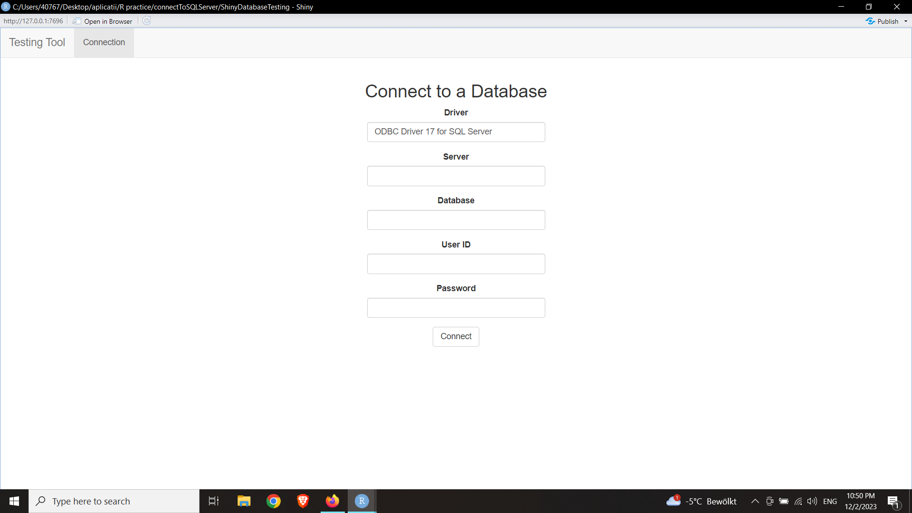
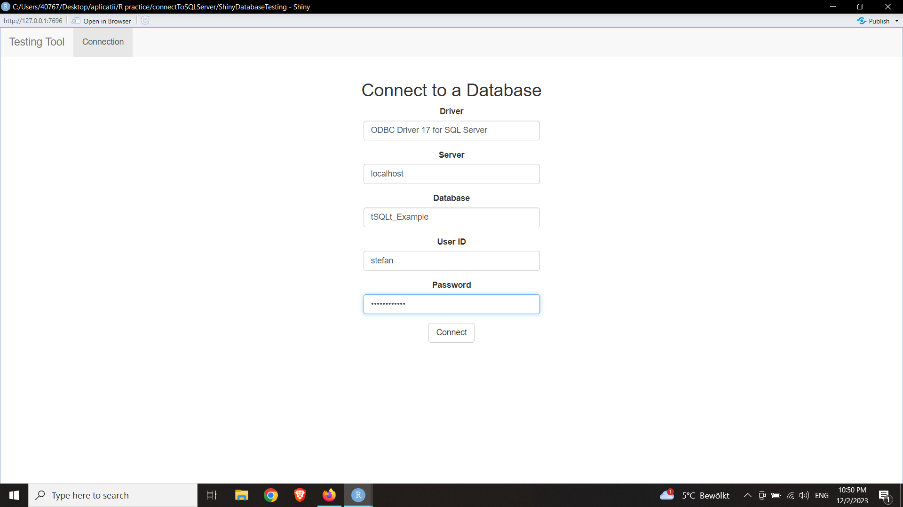
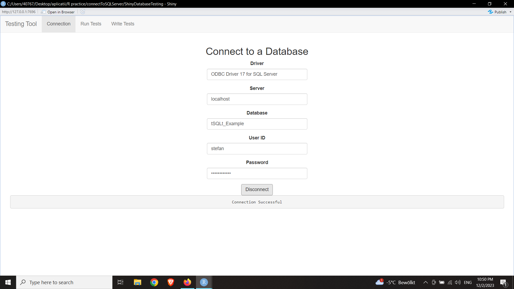
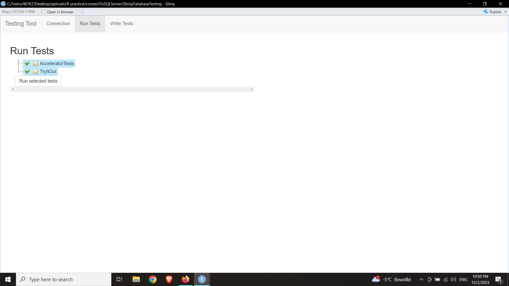
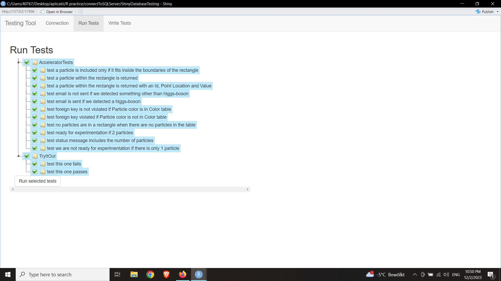
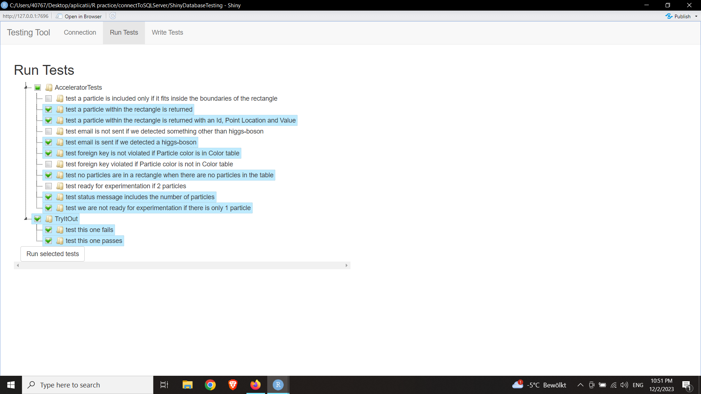
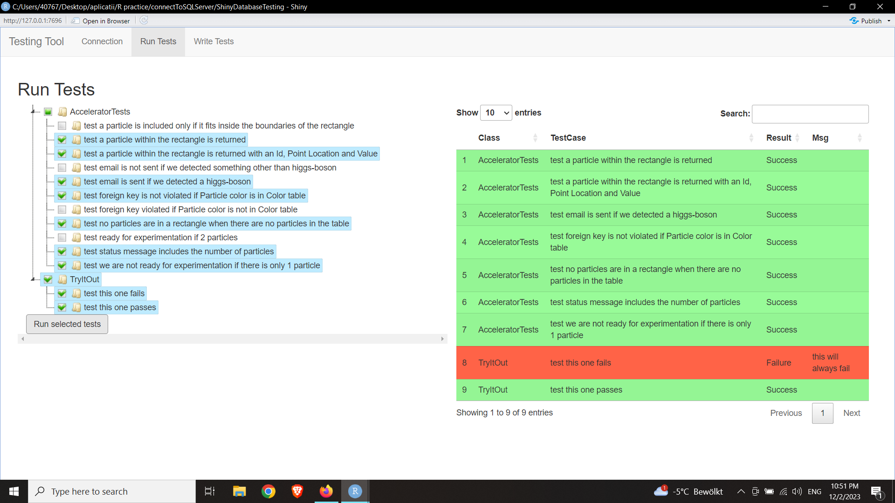
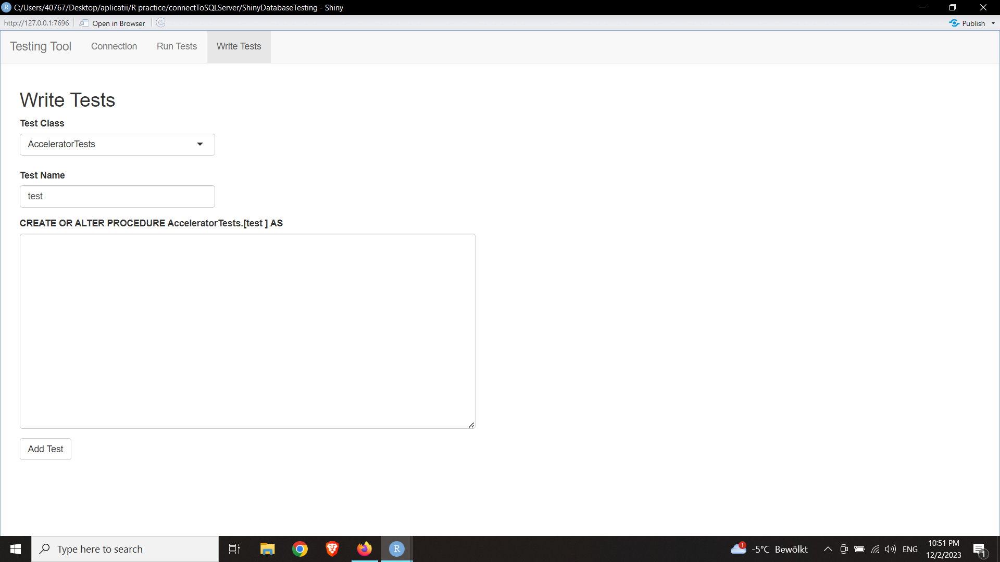
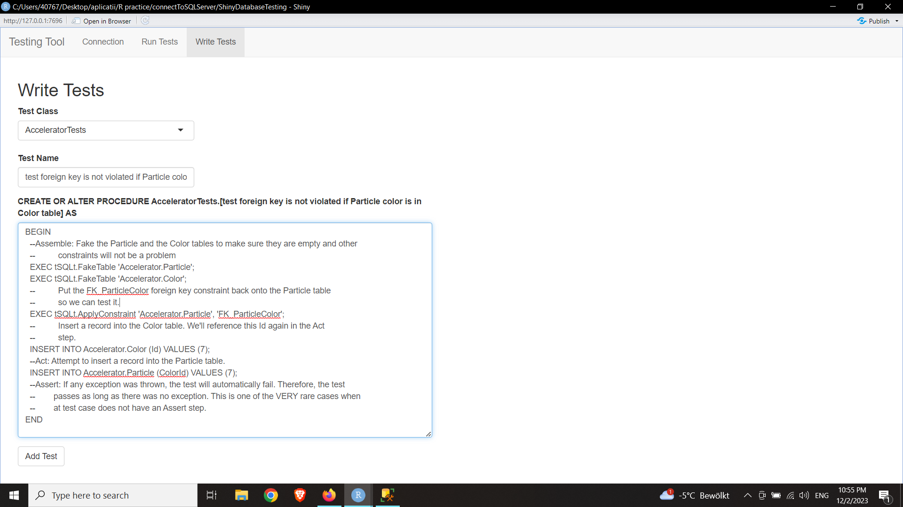
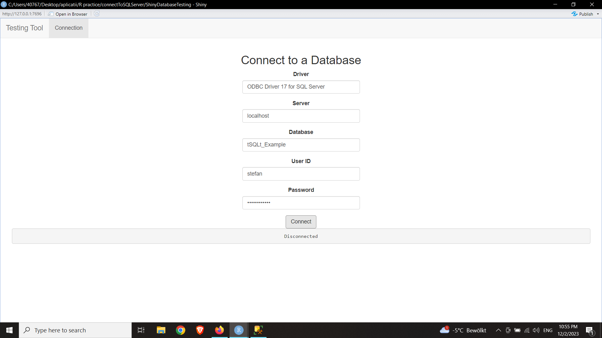

# ShinyDatabaseTesting
(work in progress...)

This is a simple Shiny tool for connecting to SQL Server Database and running/writing
tests for it, which are supported by tSQLt.

Below is a small demo which uses the tSQLt_Example database, its tests and a small
additional class of tests.

Start Screen

Fill Login Information

Connect

Run Tests Menu

Expand Test Tree

Select Tests to Run

See Results

Write Tests Menu

Sample Test

Go Back to Connect Screen

Disconnect from Database
